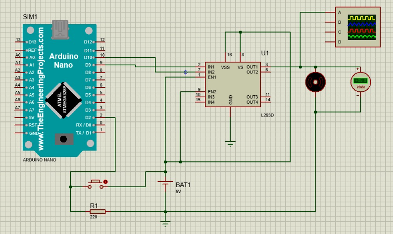

# Introdução ao PWM
PWM é a sigla para "Pulse Width Modulation", ou Modulação por Largura de Pulso. É uma técnica muito utilizada na eletrônica para controlar a potência de um sinal elétrico. É uma forma de variar a largura de um pulso elétrico, mantendo a sua frequência constante. Essa variação na largura do pulso faz com que a média da tensão aplicada seja alterada, o que resulta em um controle de potência que pode ser utilizado para controlar a velocidade de rotação de um motor elétrico por exemplo, o qual foi aplicado no projeto abaixo.

# Componentes necessários

**Montagem na ferramenta Proteus**

⚪ **Microcontrolador:** Arduino Nano;

⚪ **Ponte H:** modula os sinais recebidos do Arduino e energia recebida de uma fonte (bateria por exemplo) e transmite aos componentes carga do sistema (motor e led por exemplo);

⚪ **Botão:** utilizado para alterar os níveis de velocidade do motor elétrico;

⚪ **Resistor:** utilizado para controlar a corrente elétrica;

⚪ **Motor elétrico:** converte energia elétrica em energia mecânica;

⚪ **Voltímetro:** utilizado para visualizar a tensão elétrica do sistema;

⚪ **Osciloscópio:** utilizado para visualizar as formas e variações da onda elétrica produzida do sistema;

⚪ **Fonte 5V:** fornece energia para alimentar o sistema;

# Esquemático

<div align=center>

</div>

# Código Fonte

```javascript
#include <Arduino.h>

int botao = 2;
int motor = 9;
int estado = 0;
int velocidade = 0;
unsigned long tempo_ref = 0;
unsigned long tempo_espera = 50;

void setup()
{
  pinMode(botao, INPUT_PULLUP);
  pinMode(motor, OUTPUT);
}
void loop()
{
  int aperto = digitalRead(botao);
  if (aperto != estado)
  {
    estado = aperto;
    if (aperto == HIGH)
    {
      tempo_ref = millis();
    }
    if (aperto == HIGH && ((millis() - tempo_ref) - tempo_espera))
    {
      velocidade += 63;
    }
    if (velocidade > 255)
    {
      velocidade = 0;
    }
    analogWrite(motor, velocidade);
  }
}
```

# Funcionamento do projeto

O projeto tem como objetivo utilizar o circuito com os componentes citados para controlar a velocidade um motor elétrico, na ferramenta Proteus. É possível fazer esse controle a cada clique de um botão. Por exemplo, o sinal para o motor inicia como "0" (desligado), após cada clique o sinal é acrescido do valor 63, que é aproximadamente 25% de 255. Nas sequencias de clique o sinal para o motor muda para 50%, 75% e 100%. Quando o valor, da variável que controla o sinal, passa de 255 (neste caso 100%) a variável retorna ao valor "0", iniciando a sequência novamente. Em resumo, o objetivo deste projeto/circuito é ter a possibilidade de controlar a velocidade de um motor elétrico de forma ágil, o uso do PWM contribui para a rápida e efetiva implementação do projeto.
